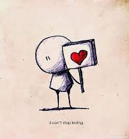

# First file for practice

## Instruction for working with Git

to create a repository, you need to write the command:

> _git init_

in first time need to write the command:

> _git config --global user.name "NAME"_

> _git config --global user.email POST@EXAMPLE.COM_

## Adding information to repository

for track added files writу the command:

> _git add <file name>_

how to save the current state:

> _git commit -m "..add info.."_

if the file is already working in the repository, then the command "add" is replaced by the tag "a" in the download "commit" type

> _git commit -a -m "..add info.."_

## Information output

to track the status of the repository:

> _git status_

for call a list of actions and saves, write the command:

> _git log_

show difference between versions command:

> _git diff_

## Transition to previous commits

switch between different versions command:

> _git checkout_

to transition to commit with code use command:

> _git checkout "..enter code.."_

to go back you need to apply

> _git checkout main_

how to add a picture (?)

> _add the pic.jpg file to the repository_

> _![img didn't load] (picture.jpg)_

## Works with branches

To view all branches you need

> _git branch_

To create new branch

_git branch branch_name_

to transition bitween the different branches

_git checkout branch_name_

to delete a branch you need to enter the command

_git branch -d_

to mergebranch
